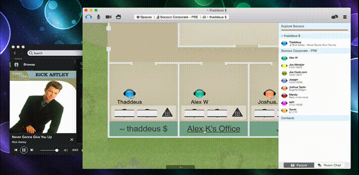
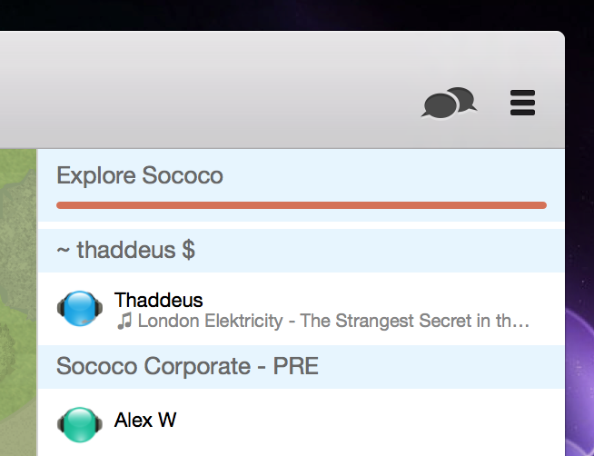

	Note: Igor requires features from the Sococo application that are not yet released.

Igor is a personal assistant for [Sococo](https://www.sococo.com) virtual offices, offering a handful of favors to make the virtual office experience even better. Igor is a standalone Mac OS X app. It implements behaviors through a combination of ScriptingBridge application control and event observation with `NSDistributedNotificationCenter`.

The Igor source is provided as a starting point for implementing other great features, and discovering the new scripting interface provided in the Sococo Mac app.

# Behaviors

`SCOfficeAssistant` is responsible for triggering actions based on events that are observed. There are a few behaviors built-in right now, and the code is simple enough that others can be easily added.

## Co-Presence

When you move to a room with other people, Igor kindly turns the music down on your local computer. This makes it easier to jump in to conversations without having to fumble for the volume controls on your music app. When you're by yourself in a room, Igor will turn your music back up to a comfortable level.

## Status Updates

Igor thinks the music you listen to is pretty cool, and wants to share your current jams with the folks in your office space. As the current track changes in your music player, Igor shares the track title and artist in your status message.

# Music App Integrations

Igor is integrated with the following music applications:

* iTunes
* Rdio
* Spotify

These apps all have feature parity within Igor in terms of event and control support. Application control (playback, volume) is implemented through the `ScriptingBridge` framework. Each app provides an AppleScript dictionary, so scripting interface classes were generated from those dictionaries. Playback status changes are supported through `NSDistributedNotificationCenter`, which is described further below.

## Script Interfaces

The `SBApplication` subclasses included for iTunes, Rdio, and Spotify were generated with the  `sdef` and `sdp` tools. Here's how the `SCRdioScriptInterface.h` file was generated:

	sdef /Applications/Rdio.app | sdp -fh --basename Rdio -o SCRdioScriptInterface.h

The nuances of each application are captured within their respective `SCMusicPlayerCommon` subclasses.

## Notifications

`NSDistributedNotificationCenter` is one mechanism for delivering notifications between applications on OS X. Conveniently, iTunes, Rdio, and Spotify all support track notifications this way. The [distnote](https://github.com/tternes/distnote) utility makes it easy to discover notifications sent by these apps.

	2014-12-12 12:48:17.664 distnote[26479:3587200] com.spotify.client.PlaybackStateChanged
	2014-12-12 12:48:17.664 distnote[26479:3587200] object(__NSCFString): com.spotify.client
	2014-12-12 12:48:17.664 distnote[26479:3587200] {
	    Album = "Platinum & Gold Collection";
	    "Album Artist" = "Rick Astley";
	    Artist = "Rick Astley";
	    "Disc Number" = 1;
	    Duration = 212;
	    "Has Artwork" = 1;
	    Name = "Never Gonna Give You Up";
	    "Play Count" = 1;
	    "Playback Position" = "85.22799682617188";
	    "Player State" = Playing;
	    Popularity = 64;
	    Starred = 0;
	    "Track ID" = "spotify:track:0FutrWIUM5Mg3434asiwkp";
	    "Track Number" = 1;
	}